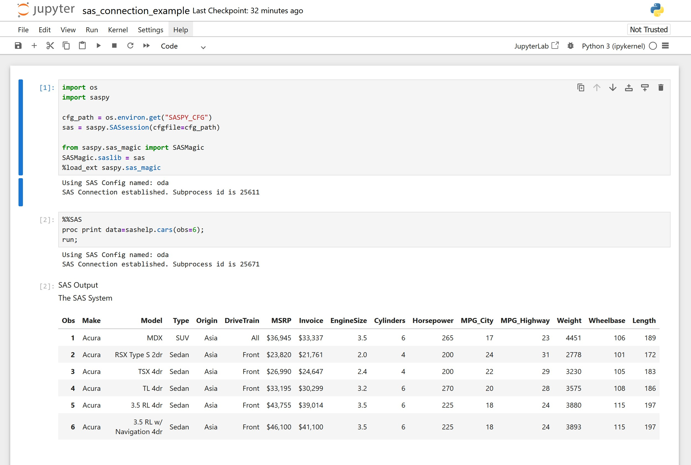
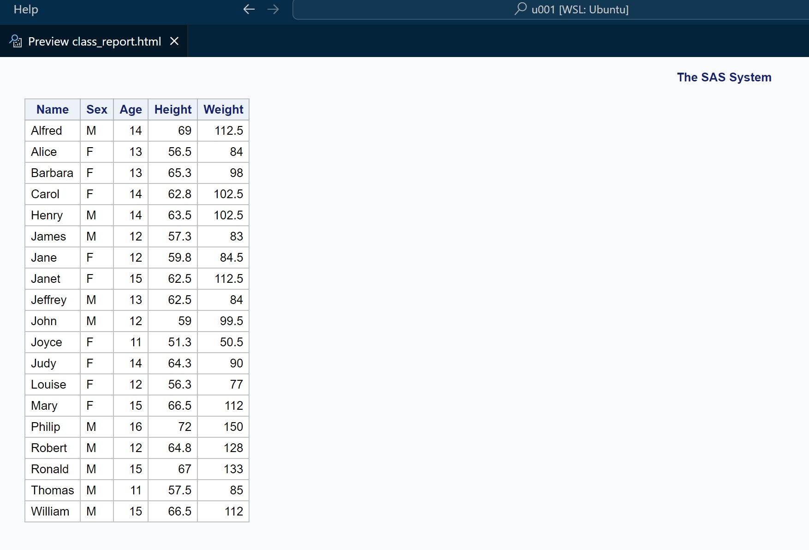

# Bridging SAS and Python in Ubuntu via Windows Subsystem for Linux (WSL) with SASPy


**Author:  Manzar Ahmed**</br>
**Date: June 2025**

## ✨ Introduction

Hey Everyone!

I've worked as a SAS engineer for several years, but more recently, many of the projects I'm involved in have been migrating away from SAS to modern tools like **Python**, **dbt**, **Snowflake**, and **Databricks**.

In a recent project, we migrated SAS code to **DuckDB**, and later into **Snowflake**. During this process, I discovered the **SASPy** Python library, which lets you run SAS code directly from Python and integrates nicely with **Visual Studio Code (VS Code)**.

I enjoy building code samples in my personal sandbox, which runs on **Ubuntu via Windows Subsystem for Linux (WSL)**. In this setup, I managed to configure SASPy to work with the **free cloud-based SAS OnDemand for Academics (ODA)**.

**SAS OnDemand for Academics (ODA)** is a free, cloud-based version of SAS offered by the SAS Institute for learning and teaching. It provides full-featured SAS capabilities in the cloud without requiring a local installation or paid license—making it ideal for students, educators, and professionals exploring SAS in open-source environments.

This guide documents the exact steps I followed to set up SASPy inside WSL and connect it to SAS OnDemand. Once integrated, you can leverage Python, Jupyter, and your local Linux tools to interact with remote SAS sessions—offering the best of both worlds: open-source flexibility and enterprise-grade analytics.

For official documentation and additional guidance, refer to the SAS support page:  
🔗 [SASPy with SAS OnDemand for Academics – Official Guide](https://support.sas.com/ondemand/saspy.html)


## ✅ Prerequisites
Ensure the following are installed inside WSL:
* Python 3.3+
* Java 1.8.0_162+
* SASPy 3.3.4+
* A SAS OnDemand for Academics account

## 🛠️ Step-by-Step Setup in WSL
1. **Install Dependencies**

In WSL terminal:
```bash
sudo apt update
sudo apt install -y python3 python3-pip openjdk-11-jdk
pip3 install saspy
```

Terminal output:
```terminal
(venv) u001@DELL-XPS13:~$ pip3 install saspy
Collecting saspy
  Downloading saspy-5.103.0-py3-none-any.whl (10.0 MB)
     ━━━━━━━━━━━━━━━━━━━━━━━━━━━━━━━━━━━━━━━━ 10.0/10.0 MB 19.5 MB/s eta 0:00:00
Installing collected packages: saspy
Successfully installed saspy-5.103.0
```

Ensure Java is installed correctly:

```bash
java -version
```
Terminal output:
```terminal
(venv) u001@DELL-XPS13:~$ java -version
openjdk version "17.0.15" 2025-04-15
OpenJDK Runtime Environment (build 17.0.15+6-Ubuntu-0ubuntu122.04)
OpenJDK 64-Bit Server VM (build 17.0.15+6-Ubuntu-0ubuntu122.04, mixed mode, sharing)
```

2. **Create** sascfg_personal.py

Find the SASPy config directory:

```py
python3 -c "import saspy; print(saspy.__file__.replace('__init__.py', 'sascfg_personal.py'))"
```

Create the file at that path (adjust if needed):

```bash
nano /home/u001/.local/lib/python3.*/site-packages/saspy/sascfg_personal.py
```

Paste this content (edit java path and uncomment your region):
```python
SAS_config_names = ['oda']

oda = {
    'java' : '/usr/bin/java',  # Confirm with `which java`
    #European Home Region 1
    'iomhost' : ['odaws01-euw1.oda.sas.com','odaws02-euw1.oda.sas.com'],
    'iomport' : 8591,
    'authkey' : 'oda',
    'encoding' : 'utf-8'
}
```

3. **Create** .authinfo File

This file stores your ODA credentials securely.
```bash
nano ~/.authinfo
```

Paste this (replace with your ODA email/username and password):
```bash
oda user ODA_USERNAME password ODA_PASSWORD
```

Then set permissions:
```bash
chmod 600 ~/.authinfo
```


## **Add Environment Variable to** `.bashrc`
Open your shell config file (depending on the shell you use):
```bash
nano ~/.bashrc
```
Add the following line at the end (edit path accordingly):
```bash
export SASPY_CFG=/home/u001/.local/lib/python3.10/site-packages/saspy/sascfg_personal.py
```
Then **reload** the profile:
```bash
source ~/.bashrc
```


**Common Problems**

```terminal
Using SAS Config named: oda
Pandas module not available. Setting results to HTML
Did not find key oda in authinfo file:/home/u001/.authinfo

Please enter the OMR user id: 
```


after entering user id (email) and password:

```bash
SAS Connection established. Subprocess id is 12109

SAS Connection terminated. Subprocess id was 12109
```

🧪 Optional: Jupyter Notebook in WSL

```bash
pip3 install notebook
jupyter notebook --no-browser --ip=0.0.0.0


```

Access from browser via http://localhost:8888 on Windows side.


## **Running SAS** in jupter Notebook
You can now run SAS code directly in Jupyter notebooks using SASPy’s magic commands. Below are two key code blocks that complete the integration.

### 🧱 **Block 1** : Initialize SASPy and Load Magic Extension
```python
import os
import saspy

# Get the path to your personal SASPy configuration
cfg_path = os.environ.get("SASPY_CFG")

# Establish a connection to SAS using the ODA profile
sas = saspy.SASsession(cfgfile=cfg_path)

# Load SAS magic commands into the notebook environment
from saspy.sas_magic import SASMagic
SASMagic.saslib = sas
%load_ext saspy.sas_magic
```

#### 💡 Explanation:
* Retrieves the SASPY_CFG environment variable set in .bashrc.
* Starts a SAS session using the oda configuration.
* Loads the %SAS magic command so you can run native SAS code directly in notebook cells.

### 🧾 **Block 2**: Run Native SAS Code Using %SAS Magic
```python
%%SAS
proc print data=sashelp.cars(obs=6);
run;
```
#### 💡 Explanation:
* The %%SAS cell magic tells Jupyter to treat the entire cell as SAS code.
* This example runs a simple PROC PRINT on the sashelp.cars dataset, showing the first 6 rows.

#### 📸 Output Preview
* Here’s an example screenshot of SAS output rendered directly in the notebook


### 🏃 Running Standalone .py Scripts with SASPy

While Jupyter notebooks are great for interactive development, you may also want to run standalone Python scripts (e.g., scheduled jobs, batch reports, or CLI tools). The utils/sas_setup.py module makes this easy by centralizing the logic needed to:

* Start a SAS session
* Print logs to the terminal
* Export results to HTML (locally or to a specified directory)

Here's a breakdown of the key utility functions and an example script using them.

#### 🧰 Utility Module: utils/sas_setup.py

This file contains reusable helper functions for working with SASPy.

🔧 start_sas_session()

```python
import os
import saspy

def start_sas_session():
    """
    Starts a SASPy session using the SASPY_CFG environment variable and
    submits an optional autoexec file if found.

    Returns:
        saspy.SASsession object
    """
    cfg_path = os.environ.get("SASPY_CFG")
    if not cfg_path:
        raise EnvironmentError(
            "SASPY_CFG environment variable is not set."
        )

    sas = saspy.SASsession(cfgfile=cfg_path)

    autoexec_path = os.path.expanduser('/home/u001/autos.sas')
    if os.path.exists(autoexec_path):
        with open(autoexec_path, 'r') as f:
            sas.submit(f.read())

    return sas
```
#### Purpose:
Starts a SAS session using the SASPY_CFG environment variable. It also submits an optional ~/autos.sas file if found, which can be used for auto-loading macros or libraries.

#### 🖨️ print_sas_log(submit_result)
```python
def print_sas_log(submit_result):
    """
    Prints the SAS log from a saspy.submit() result dictionary.

    Args:
        submit_result (dict): The dictionary returned by sas.submit(...)
    """
    print("-" * 25, "SAS LOG", "-" * 25)
    print(submit_result.get('LOG', '[No LOG found in result]'))
    print("-" * 61)
```    

#### Purpose:
Prints a well-formatted version of the SAS log after code execution — handy for checking syntax errors or debugging without opening a SAS GUI.

#### 💾 sas_output(output_dir, filename, html_content)
```python
def sas_output(output_dir, filename, html_content):
    """
    Write the given HTML content to a file in the specified directory
    and print the file path.

    Args:
        output_dir (str): Path to the output directory.
        filename (str): Desired filename (e.g., "report.html").
        html_content (str): HTML content to be written.

    Returns:
        str: Full path of the written file.
    """
    os.makedirs(output_dir, exist_ok=True)
    html_output_path = os.path.join(output_dir, filename)

    with open(html_output_path, 'w', encoding='utf-8') as f:
        f.write(html_content)

    print(f"\n✅ HTML report saved to: {html_output_path}")
    return html_output_path
```    

#### Purpose:
Saves the HTML output returned by SAS procedures (e.g., result['LST']) to a file and prints the path.

#### 🧪 Example Script: generate_report.py

This script runs a SAS PROC REPORT from within a .py file, and saves the output to an HTML file under ~/reports.
```python
"""
-------------------------------------------------------------------------------------------------
Program:        generate_report.py
Project:        saspy_sample
Description:    generate a sample report
Input(s):       sashelp.class
Output(s):      html report in ~/reports/class_report.html
Author:         Manzar Ahmed
First Created:  05-Jun-2025
-------------------------------------------------------------------------------------------------
Program history:
-------------------------------------------------------------------------------------------------
Date        Programmer                Description
----------  ------------------------  -----------------------------------------------------------
2025-06-05  Manzar Ahmed              v0.01/Initial version
-------------------------------------------------------------------------------------------------
"""
import os
from utils.sas_setup import start_sas_session, print_sas_log, sas_output

output_path = os.path.expanduser('~/reports')

sas = start_sas_session()

sas_code = """
proc report data=sashelp.class nowd;
    column name sex age height weight;
    define name / display;
    define sex / display;
    define age / analysis;
    define height / analysis;
    define weight / analysis;
run;
"""

result = sas.submit(sas_code, results='html')

print_sas_log(result)

sas_output(output_path, "class_report.html", result['LST'])

```
#### 📂 You can run this like any normal script:

```bash
python3 generate_report.py
```

Terminal output when running the script:

```bash
(venv) u001@DELL-XPS13:~$ /home/u001/pgadmin4/venv/bin/python /home/u001/saspy_sample/generate_report.py
Using SAS Config named: oda
SAS Connection established. Subprocess id is 34090

------------------------- SAS LOG -------------------------
5                                                          The SAS System                        Thursday, June  5, 2025 10:41:00 AM

24         ods listing close;ods html5 (id=saspy_internal) file=_tomods1 options(bitmap_mode='inline') device=svg style=HTMLBlue;
24       ! ods graphics on / outputfmt=png;
25         
26         
27         proc report data=sashelp.class nowd;
28             column name sex age height weight;
29             define name / display;
30             define sex / display;
31             define age / analysis;
32             define height / analysis;
33             define weight / analysis;
34         run;
35         
36         
37         
38         ods html5 (id=saspy_internal) close;ods listing;
39         
6                                                          The SAS System                        Thursday, June  5, 2025 10:41:00 AM

40         
-------------------------------------------------------------

✅ HTML report saved to: /home/u001/reports/class_report.html
SAS Connection terminated. Subprocess id was 34090
```
#### What It Does:

  - Starts a SAS session using your WSL + SAS OnDemand config.
  - Runs a PROC REPORT on sashelp.class.
  - Prints the execution log to the terminal.
  - Saves the HTML output as ~/reports/class_report.html.


  📸 Example Output:
  - The script will generate an HTML report similar to the one below:

This report will be saved in the ~/reports directory, and you can open it in any web browser to view the formatted table.



## Conclusion
This guide provides a comprehensive walkthrough for setting up SASPy in WSL and connecting it to SAS OnDemand for Academics. By following these steps, you can leverage the power of SAS analytics directly from Python, enabling a flexible and modern data science workflow.

While this example uses SAS OnDemand, the same approach can be adapted to work with:
- ✅ SAS on-premise installations
- ✅ SAS Viya environments (with appropriate configuration)

This makes SASPy a versatile bridge between SAS and open-source ecosystems, whether you're experimenting in a cloud sandbox or building enterprise-grade production workflows.

I hope you find this setup useful for your projects, whether you're transitioning from SAS to Python or simply want to integrate SAS capabilities into your existing workflows.

Feel free to reach out if you have any questions or run into issues during setup. Happy coding! 🚀